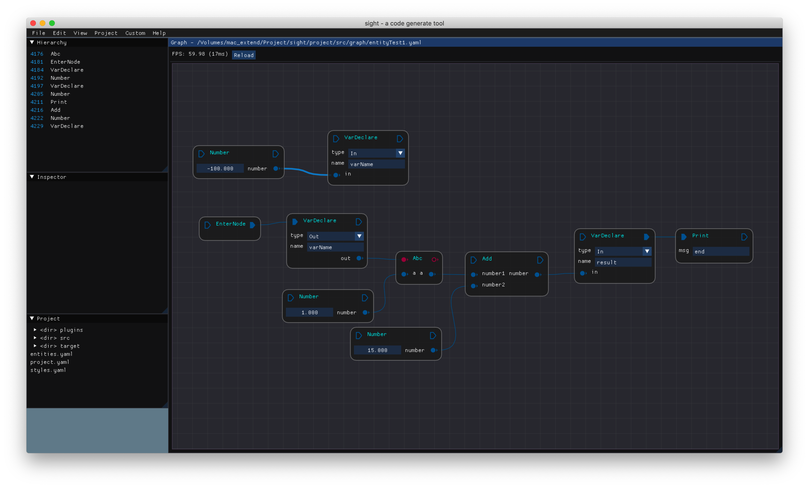
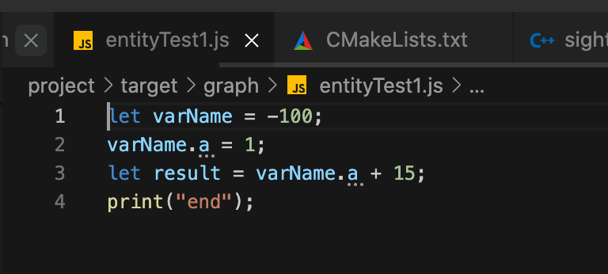
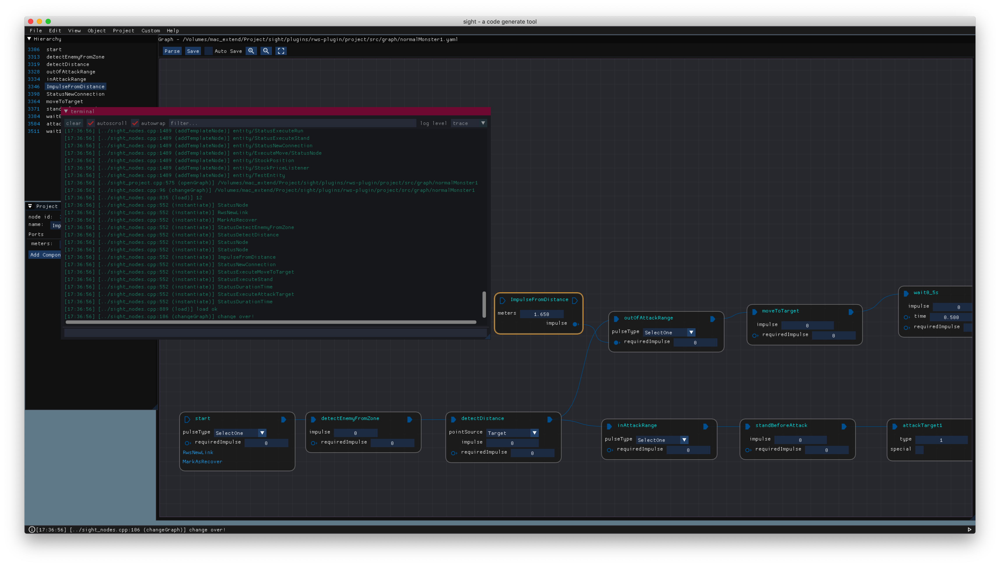
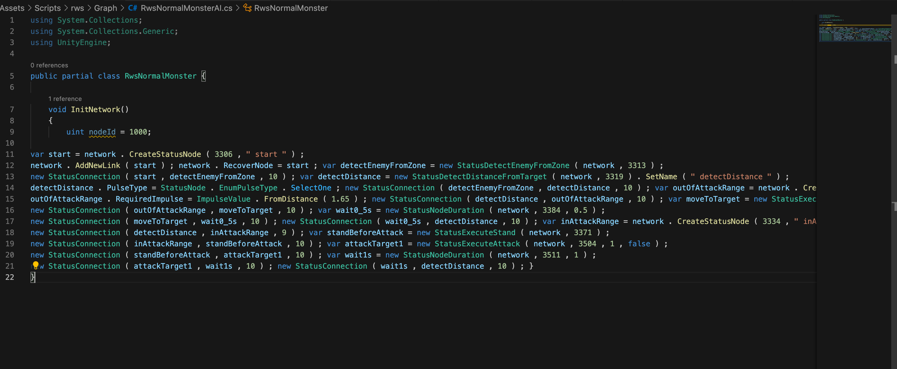

# sight
**WIP**

- Generate json from a graph. 
- Generate js code from a graph.


## how to build

### install dep

Some dependdencies is in the `dependdencies ` folder, but some not.

So, first we should update the `dependdencies ` folder. 

Use command `git submodule update --init` for that.

**Mac**

```shell
brew install v8
brew install yaml-cpp
brew install libuv
brew install abseil
```


## Screenshot





It still has some work to do, this graph is just an example.






graph -> js -> csharp.


## Operation

### Mark and then ...

Right click on a node, then click `Mark`, the node will be marked.

Click on a connection, press `ctrl + q`, the marked node will be inserted at the middle of the connection.

Right click on another node, then click `Replace From`,  it will exchange two nodes, some connections will drop, and some will exchange too.

### Detach a node

Hold `alt` and left click on a node, then the node will be detached, the title bar ports's connections will do follow work: left connection will change it's right to the right connection's right port. And components of left connection will be keep. And the right connection will be dropped.


